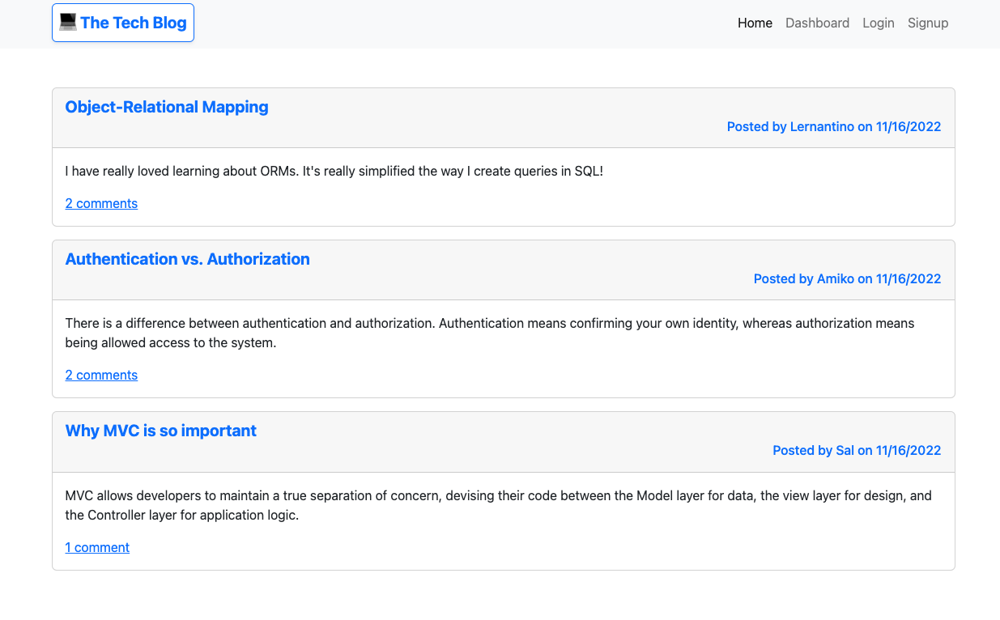
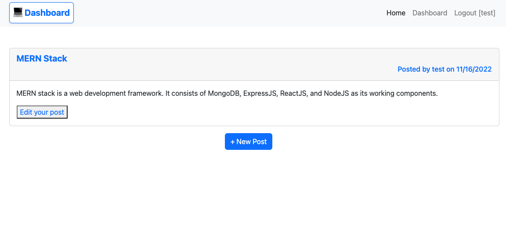
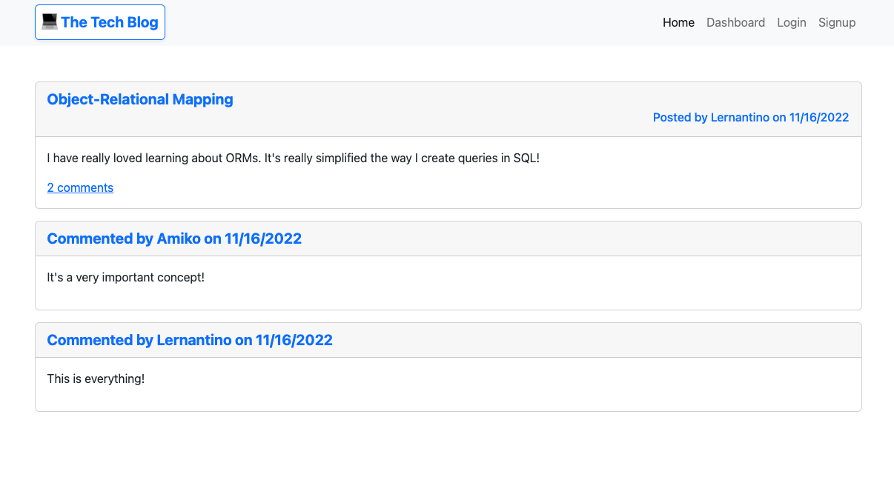

# The Tech Blog

## Badges:
---


## Table of Contents:
---
- [Description](#description)
- [Installation](#installation)
- [Usage](#usage)
- [Demo](#demo)
- [Screenshots](#screenshots)
- [License](#license)
- [Questions](#questions)

## Description:
---
This application is a CMS-style blog site similar to a Wordpress site, where developers can publish their blog posts and comment on other developers’ posts. It follows the MVC paradigm in its architectural structure, using Handlebars.js as the templating language, Sequelize as the ORM, and the express-session npm package for authentication.

## Installation:
---
To install this app, clone the repo first:
```
git clone git@github.com:daisyle0203/Tech_Blog.git
```
Run the following command to install dependencies:
```
npm i
```
Before running the app, you need to run the schema file so you will have a starting database to work with. Make sure to log into mysql and then key:
```
source db/schema.sql
```
Load the database:
```
npm run seed
```
## Usage:
---
After you run npm i, you should have all the dependencies that are needed to use the app. Simply run the following command to start the app:

```
node server.js
```
## Demo :
---
Check out the live application in [Heroku](https://tranquil-waters-66341.herokuapp.com/).
## Screenshots :
---
Homepage:



Dashboard:



Comment Page:




## License:
---


## Questions:
---

If you have any questions, you may contact me at either <br>
Github: https://github.com/daisyle0203
<br>
or
<br>
Email: [daisy.le0203@gmail.com](mailto:daisy.le0203@gmail.com)

---

[Top of Page](#the-tech-blog)